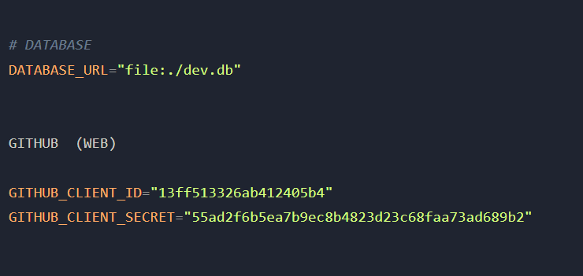
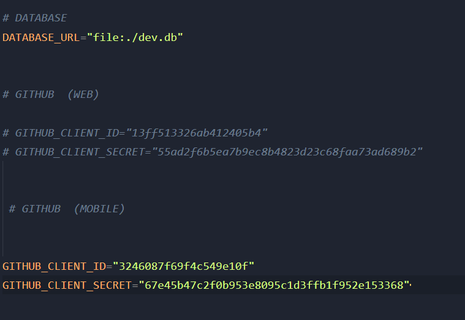
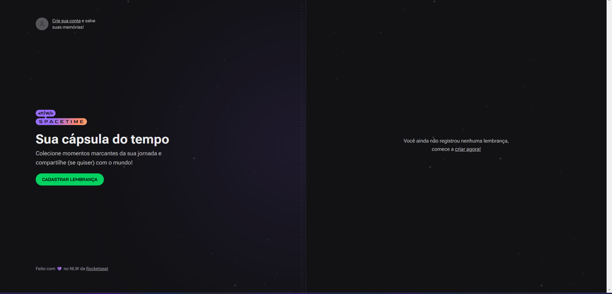
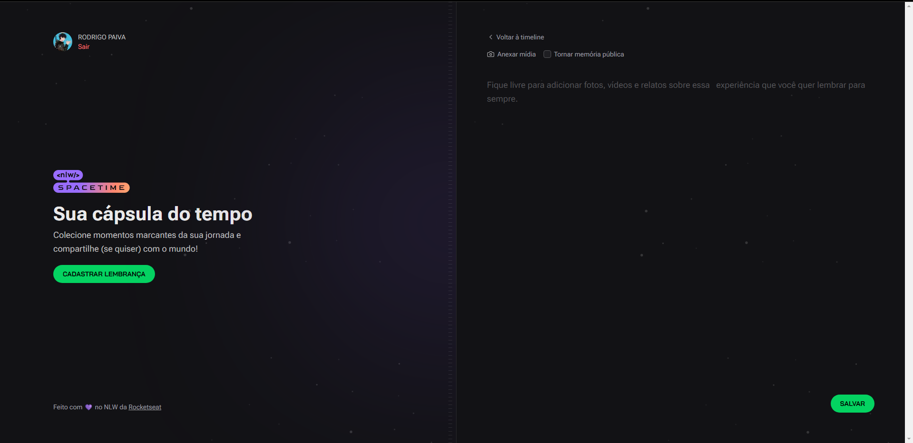
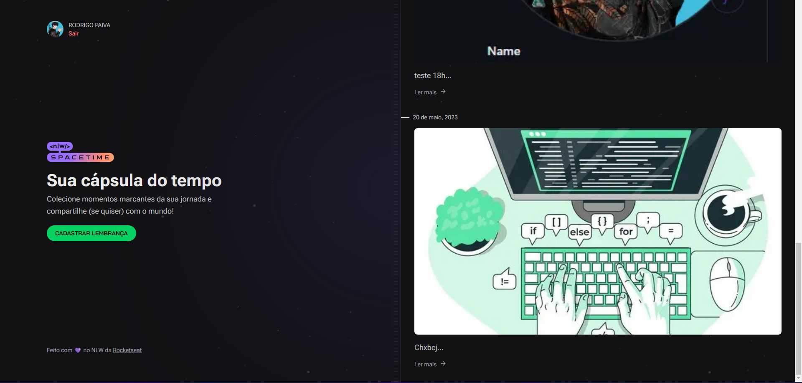
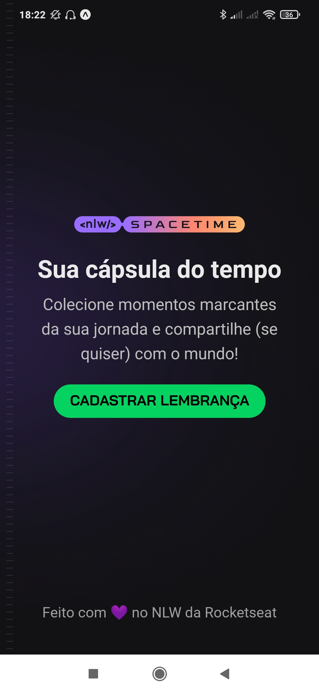
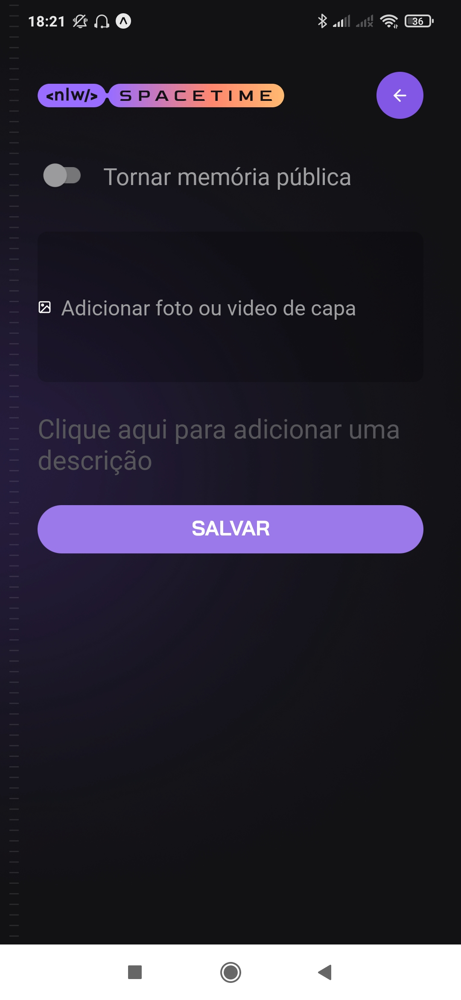

<h1 align="center">NLW Spacetime (WEB)</h1>

### Aplicação desenvolvida durante a semana do NLW da Rocketseat.

<br><br>
## Como executar a aplicação ⚙️

> Criar um arquivo ```.env``` na raiz da pasta server e adicionar, para criar conexão com o GitHub

``` ruby
  # DATABASE
DATABASE_URL="file:./dev.db"


# GITHUB  (WEB)

GITHUB_CLIENT_ID="13ff513326ab412405b4"
GITHUB_CLIENT_SECRET="55ad2f6b5ea7b9ec8b4823d23c68faa73ad689b2"


 # GITHUB  (MOBILE)


 GITHUB_CLIENT_ID="3246087f69f4c549e10f"
 GITHUB_CLIENT_SECRET="67e45b47c2f0b953e8095c1d3ffb1f952e153368"
```


### Para executar a aplicação WEB:

> Criar um arquivo ``` .env.local ``` na raiz do projeto e adicionar, para criar conexão com GitHub

```php 
  NEXT_PUBLIC_GITHUB_CLIENT_ID="13ff513326ab412405b4"
```

#### Ativar as variáveis ambiente da web no backend  



### Excutar os seguintes comandos:

``` js
  npm install
```
- Para instalar as dependências da aplicação

``` js
  npm run dev
```
- Para executar a aplicação (WEB e BACKEND)
<br><br>


### Para executar a aplicação Mobile:
#### Ativar as variáveis ambiente da mobile no backend  

> Criar um arquivo



### Excutar os seguintes comandos:

``` js
  npm install
```
- Para instalar as dependências da aplicação

``` js
  npm run dev
```
- Para iniciar o servidor no arquivo backend

``` js
  npm run start
```
- Para executar a aplicação no Expo


<br><br>


## O que foi desenvolvido 🚀
Aplicação onde você pode adicionar suas memórias favoritas, além disso, fazendo login pelo GitHub.

## Versão Web </br></br>
<h3 align="center">Página inicial</h3> </br>



<h3 align="center">Efetuado login pelo GitHub</h3> </br>

<div align="center"></div>


<h3 align="center">Tela de listagem das memórias adicionadas</h3> </br>

<div align="center"></div>


## Versão Mobile </br></br>
<h3 align="center">Tela de login (Página inícial)</h3> </br></br>

<div align="center"></div>


</br></br></br><h3 align="center">Adicionar memória</h3> 

<div align="center"></div>


</br></br></br></br><h3 align="center">Tela de listagem das memórias adicionadas</h3> </br>

<div align="center"></div>


<br><br>
## Como foi desenvolvido 📋

## Tecnologias Utilizadas
- React
- Typescript
- Next.js
- TailwindCSS
- Eslint
- Expo Go
- Fastify
- Zod


